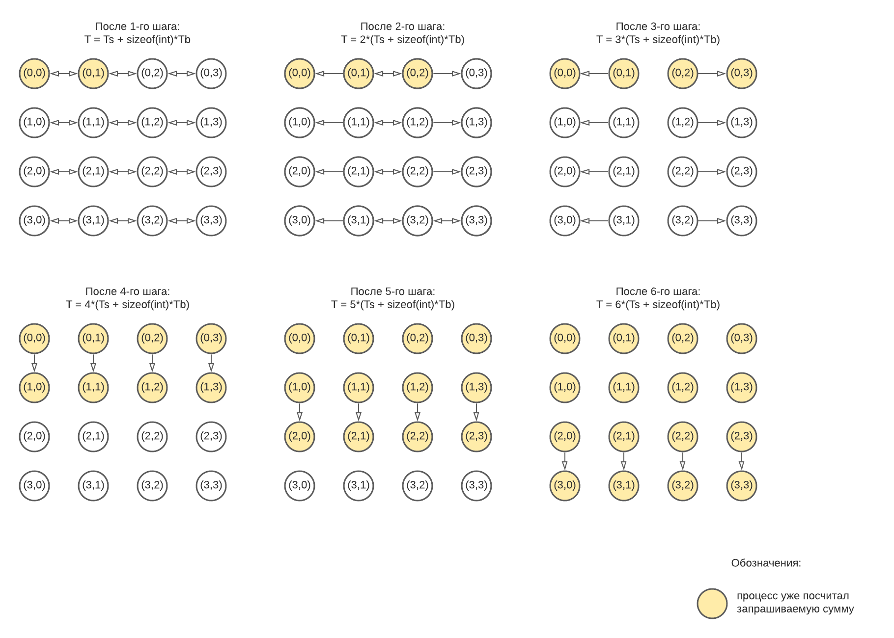

# Распределенные системы

## Задача 1
Реализовать программу, моделирующую выполнение операции MPI_Scan для транспьютерной матрицы размером 4*4 при помощи пересылок MPI типа точка-точка.

    git clone https://github.com/prokopk1n/mpi_programms
    cd task1
    make run_omp
  

## Задача 2
Реализовать программу, которая находит ранг произвольной матрицы, используя параллельные вычисления. Данная программа должна быть устойчива ко сбоям в любом процессе.

    git clone https://github.com/prokopk1n/mpi_programms
    cd task2
    make run_new
